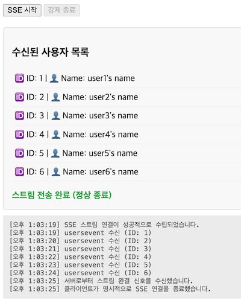

# SpringBoot에서 Server-Sent Events 구현하기

### 구현 사양

- OpenJDK 25
- Springboot 4
- WebMvc.Fn
- VanillaJs
- 5-step architecture

## Server-Sent Events 란

WHATWG의 Server-Sent Events(SSE) 명세는 서버가 단방향으로 클라이언트(브라우저)에게 실시간 이벤트를 푸시할 수 있도록 지원하는 웹 표준 명세입니다. WebSockets와 달리 전통적인 **HTTP 프로토콜(주로 HTTP/1.1 Persistent Connection 또는 HTTP/2, HTTP/3 Multiplexing)** 위에서 동작하므로, 프록시나 방화벽 환경에 친화적이며 추가적인 가상 프로토콜 레이어가 필요하지 않습니다.

클라이언트 브라우저는 명세에 기술된 `EventSource` 인터페이스를 구현하여 서버와 지속적인 스트림 연결을 맺습니다.

## SSE 활용 범위

1. AI 응답 실시간 스트리밍 (LLM Streaming)
2. 실시간 알림 및 푸시 알림 (Notification System)
3. 실시간 모니터링 및 대시보드 (Real-time Dashboards)
4. 실시간 피드 및 콘텐츠 업데이트 (Live Feeds)
5. 대용량 작업 진행률 추적 (Background Job Progress)


## 테스트 해보는 법

- 터미널에서 다음의 명령어를 실행하거나, IDE에서 스프링부트 애플리케이션 실행

```sh
$ ./gradlew bootRun
```

- 브라우저에서 http://localhost:8080/index.html 로 접속
- 'sse접속' 버튼을 클릭하면 1초 단위로 데이터가 나타남. 



## 주요 코드 

- src/main/java/dev/ohhoonim/user/endpoint/UserRouter.java
- src/main/resources/static/index.html