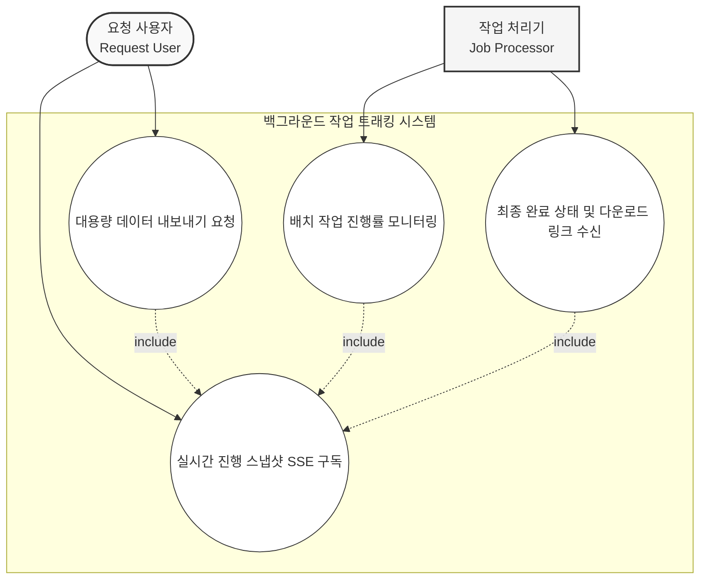
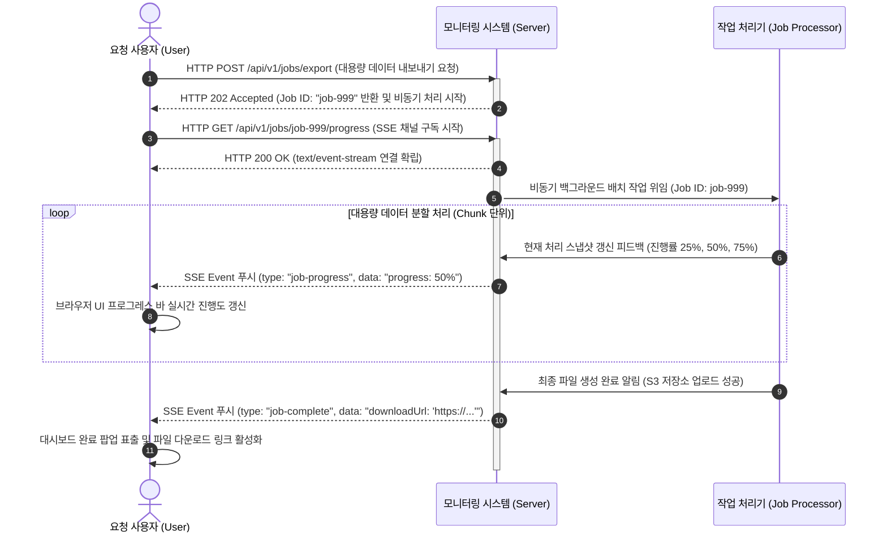
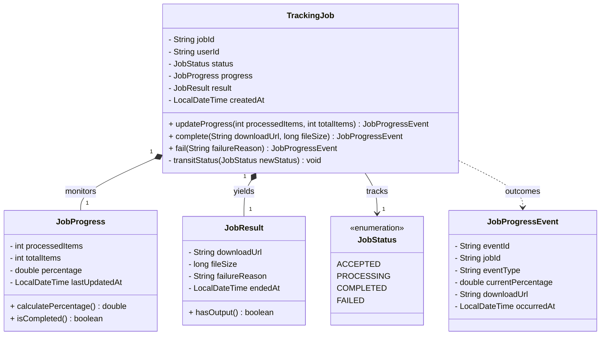
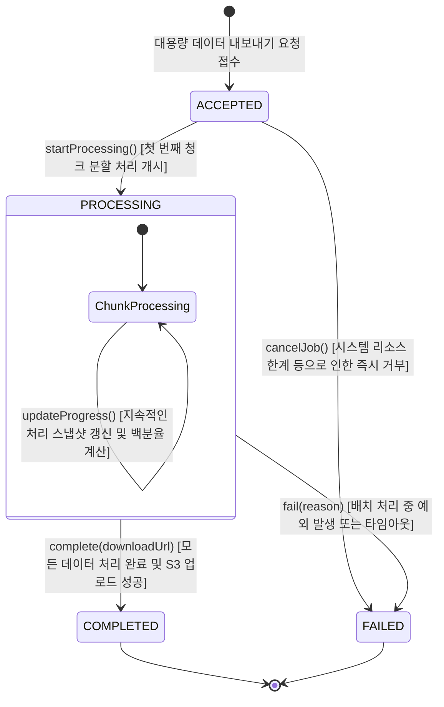

# Background Job Tracking

Background Job Tracking: 대용량 배치 및 데이터 내보내기 작업의 처리 스냅샷과 최종 완료 상태를 실시간으로 클라이언트에 피드백함.

## Usecase

## Sequence

## Domain model

## State Transition

## Policy

**요약 목록**

* **TrackingJob 상태 제약**: 작업이 접수(`ACCEPTED`)되거나 처리 중(`PROCESSING`)일 때만 변경이 가능하며, 최종 상태(`COMPLETED`, `FAILED`)에 도달하면 모든 필드는 불변(Immutable) 상태로 동결됩니다.
* **JobProgress 산출 규칙**: 총 아이템 수 대비 처리된 아이템 수의 무결성을 검증하고, 백분율 진행도(`percentage`)를 항상 0%에서 100% 사이로 제어합니다.
* **JobResult 다운로드 및 실패 정보 검증**: 작업 성공 시 유효한 다운로드 경로 및 파일 크기를 강제하고, 실패 시에는 원인 메시지를 필수로 기록해야 합니다.

---

### 1. TrackingJob (애그리게잇 루트) 규칙 및 유효성 검사

* **상태 기반 행위 가드 규칙**
* `updateProgress()`는 오직 `status`가 `ACCEPTED` 또는 `PROCESSING`일 때만 호출할 수 있습니다. 첫 호출 시에는 상태가 `PROCESSING`으로 자동 전이되어야 하며, 이미 `COMPLETED`되거나 `FAILED`된 작업에 대한 프로그레스 업데이트 시도는 도메인 예외를 발생시켜야 합니다.
* `complete()`와 `fail()` 메서드는 **최종 터미널(Terminal) 상태로의 전이**를 담당하므로, 이미 `COMPLETED` 혹은 `FAILED`인 상태에서는 중복 처리가 불가능하도록 전이 가드를 작동해야 합니다.

* **원자적 도메인 이벤트 발행**
* 진행률 갱신, 최종 완료, 실패 처리 시 생성되는 `JobProgressEvent`는 각 상태 변경 및 결과 데이터 바인딩과 **동시에 원자적으로 생성**되어야 하며, SSE 브로드캐스팅 레이어로 즉시 전달될 수 있는 상태 정보를 완전하게 내포해야 합니다.

### 2. JobProgress (밸류 오브젝트) 유효성 검사 규칙

* **수치적 정합성 검증**
* 총 대상 아이템 수(`totalItems`)는 항상 0보다 큰 양수(`totalItems > 0`)여야 합니다.
* 현재 처리된 아이템 수(`processedItems`)는 0 이상이어야 하며, `totalItems`를 초과할 수 없습니다 (`0 <= processedItems <= totalItems`).

* **진행 백분율 제어 (`calculatePercentage`)**
* `percentage`는 수식 $(processedItems / totalItems) * 100$에 의해 도메인 내부에서 안전하게 계산되어야 하며, 임의의 외부 조작에 의해 100%를 초과하거나 0% 미만으로 떨어지지 않도록 가드합니다.

### 3. JobResult (밸류 오브젝트) 유효성 검사 규칙

* **성공 산출물 무결성 가드 (`complete` 시)**
* 작업이 정상적으로 완료되어 `COMPLETED` 상태로 진입할 때, `downloadUrl`은 절대로 null이거나 비어있을 수 없으며 올바른 URI 포맷을 충족해야 합니다.
* 생성된 파일 크기(`fileSize`)는 0 바이트보다 커야 합니다 (`fileSize > 0`). 성공 상태임에도 파일 크기가 0이거나 URL이 누락되는 논리적 모순을 도메인 수준에서 방단합니다.

* **실패 원인 기록 강제 (`fail` 시)**
* 작업이 예외나 타임아웃으로 인해 `FAILED` 상태로 진입할 때, `failureReason`은 추후 관리자 추적 및 사용자 피드백을 위해 반드시 사유가 기록되어야 하며 빈 문자열을 허용하지 않습니다.