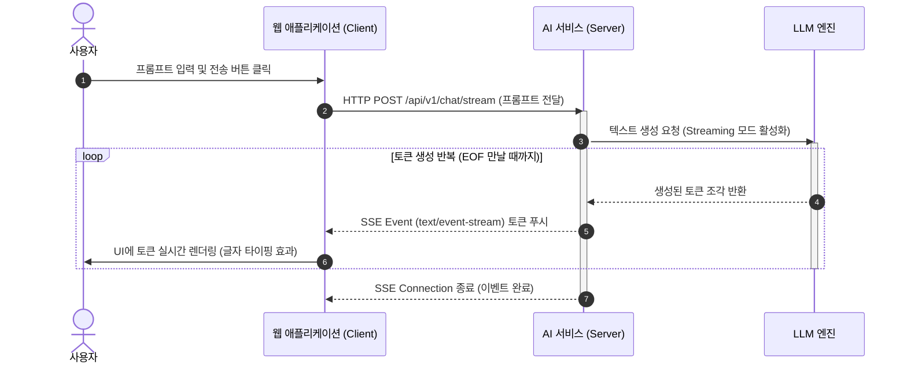
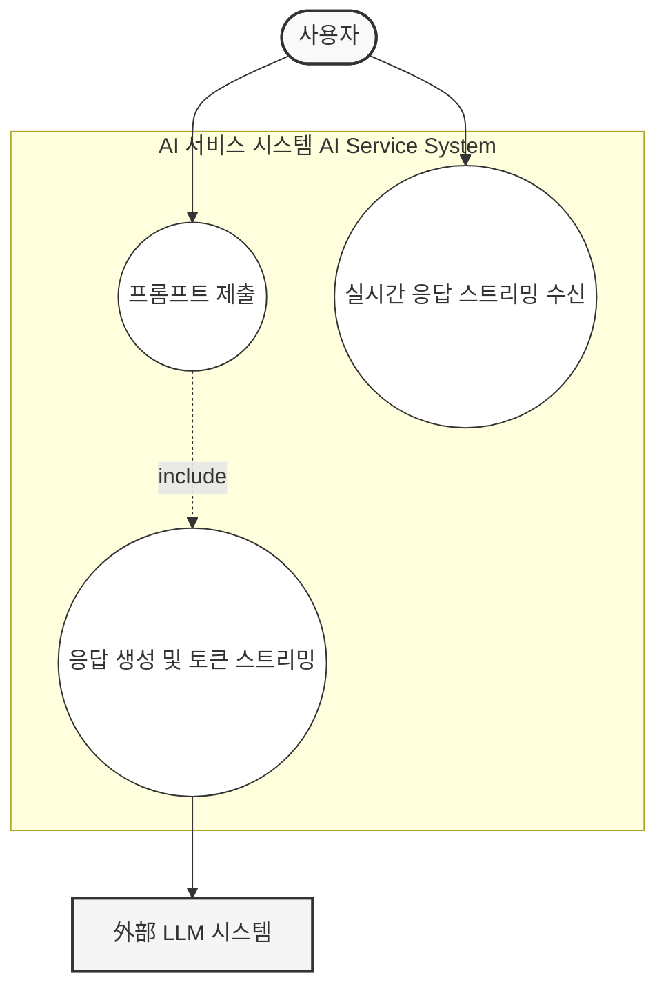
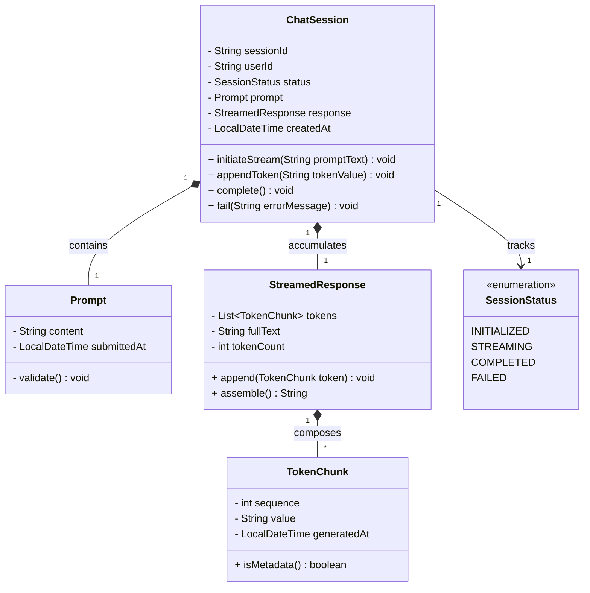
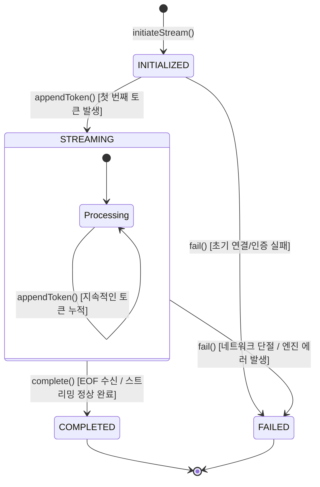

# LLM Streaming

LLM Streaming: 사용자가 프롬프트를 제출하면 서버가 생성된 토큰을 즉시 단방향 스트리밍으로 전달하여 대기 시간을 최소화함.

## sequence 

## usecase

## Domain Model

## State Transition

## Policy

**요약 목록**

* **ChatSession 규칙**: 현재 상태(`SessionStatus`)에 따른 행위 제한 및 전이 규칙 검증이 핵심임.
* **Prompt 규칙**: 텍스트 검증(공백, 최대 길이) 및 불변성 유지가 필수적임.
* **StreamedResponse & TokenChunk 규칙**: 토큰 순서(`sequence`) 보장, 원자적 누적 및 무결성 검증이 요구됨.

---

### 1. ChatSession (애그리게잇 루트) 규칙 및 유효성 검사

* **식별자 및 소유자 검증**
* `sessionId`와 `userId`는 객체 생성 시 절대 누락될 수 없으며, 변경 불가능한(Immutable) 구조여야 합니다.

* **상태 전이 기반의 비즈니스 규칙 (가장 중요)**
* `appendToken()`은 상태가 `INITIALIZED` 또는 `STREAMING`일 때만 호출 가능해야 합니다. 이미 `COMPLETED`이거나 `FAILED`인 세션에 토큰을 추가하려고 하면 도메인 예외를 발생시킵니다.
* `complete()`는 `STREAMING` 상태에서만 호출될 수 있으며, 최소 1개 이상의 토큰이 누적되어 있어야 정상 완료로 간주하는 규칙을 정의할 수 있습니다.
* `fail()`은 `COMPLETED`를 제외한 모든 상태(`INITIALIZED`, `STREAMING`)에서 전이 가능해야 합니다.

### 2. Prompt (밸류 오브젝트) 규칙 및 유효성 검사

* **콘텐츠 제약 조건 (`validate()`)**
* `content`는 비어있거나(Empty/Blank) 화이트스페이스로만 구성될 수 없습니다.
* LLM 엔진의 최대 입력 컨텍스트(토큰/글자 수) 제한에 걸리지 않도록 최대 길이(Max Length) 정책을 검증해야 합니다.

* **생성 시점 규칙**
* `submittedAt`은 미래 시간이 될 수 없으며, 요청이 들어온 현재 시점의 정밀한 타임스탬프를 가져야 합니다.

### 3. StreamedResponse 규칙 및 유효성 검사

* **원자적 상태 일관성**
* `append(TokenChunk token)` 메서드가 호출될 때, 내부 리스트에 토큰이 추가됨과 동시에 `fullText` 문자열 결합 및 `tokenCount` 증가가 하나의 원자적 연산으로 수행되어 객체 내부 정합성을 유지해야 합니다.

* **불변 뷰 제공**
* 외부로 `tokens` 리스트를 노출할 경우, 외부에서 리스트를 임의로 수정(`add`, `remove`)할 수 없도록 반드시 읽기 전용 뷰(`Collections.unmodifiableList`) 형태로 반환해야 합니다.

### 4. TokenChunk (엔티티 또는 밸류 오브젝트) 규칙 및 유효성 검사

* **순서 및 연속성 검증**
* `sequence`는 0보다 큰 정수여야 하며, `StreamedResponse`에 누적될 때 이전 토큰의 `sequence + 1` 인지 연속성을 검증하여 비동기 스트리밍 중 데이터 누락이나 순서 뒤바뀜이 발생했는지 체크할 수 있어야 합니다.

* **값 검증**
* 스트리밍 종료 신호(EOF 메타데이터 토큰)가 아닌 일반 토큰의 `value`는 `null`일 수 없습니다. (단, 빈 문자열 `""`은 공백 표현을 위해 허용될 수 있음)

## 프롬프트

"LLM Streaming: 사용자가 프롬프트를 제출하면 서버가 생성된 토큰을 즉시 단방향 스트리밍으로 전달하여 대기 시간을 최소화함." 에 대한 유스케이스 다이어그램을 mermaid로 작성해줘.