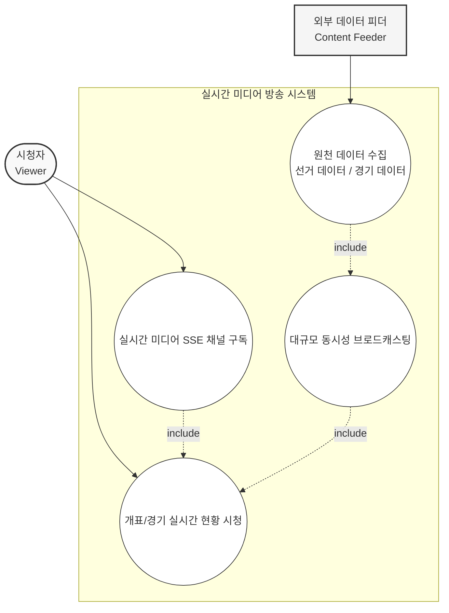
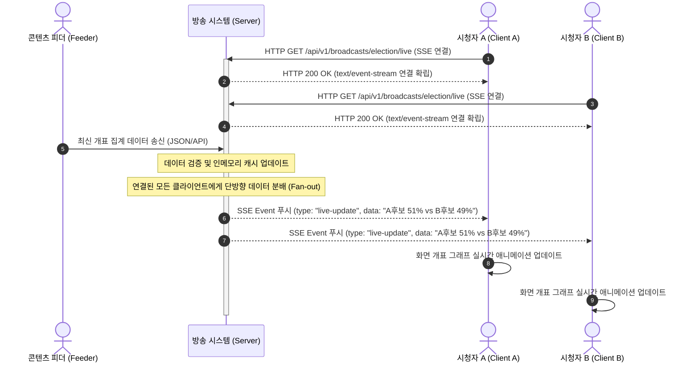
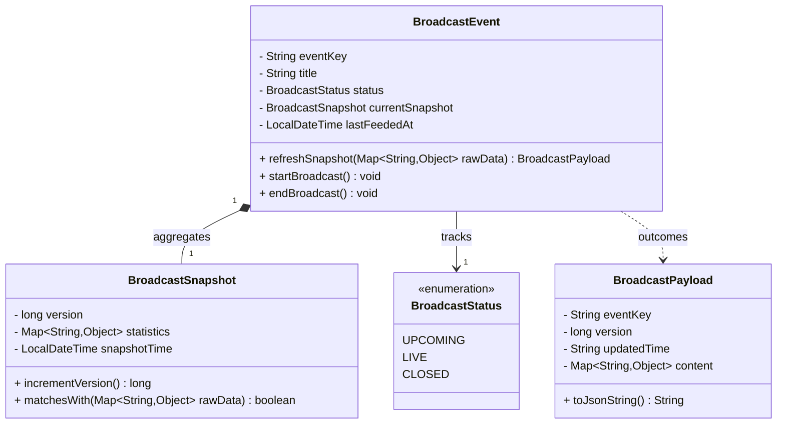
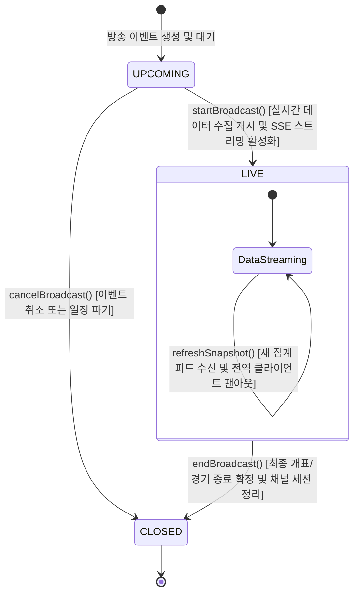

# Live Media Broadcast
Live Media Broadcast: 선거 개표나 경기 상황 등의 실시간 집계 데이터를 접속 중인 모든 클라이언트에게 동시에 스트리밍함.
## Usecase

## Sequence

## Domain Model

## State Transition

## Policy

**요약 목록**

* **BroadcastEvent 상태 제약**: 라이브(`LIVE`) 상태에서만 스냅샷 갱신이 가능하며, 종료(`CLOSED`) 후에는 모든 데이터가 읽기 전용(Immutable)으로 동결됨.
* **BroadcastSnapshot 동시성 및 데이터 검증**: 데이터 버전 제어를 통해 이전 데이터 유입을 방지하고, 변경 사항이 없는 동일 피드는 브로드캐스팅 대상에서 제외함.
* **BroadcastPayload 불변성 규칙**: 실시간 팬아웃 분배 과정에서 수만 명의 클라이언트에게 스레드 안전(Thread-safe)하고 동일한 데이터 포맷을 보장함.

---

### 1. BroadcastEvent (애그리게잇 루트) 규칙 및 유효성 검사

* **상태 기반 행위 가드 규칙**
* `refreshSnapshot()`은 오직 `status`가 `LIVE`인 상태에서만 실행 가능합니다. `UPCOMING`이나 `CLOSED` 상태에서 집계 데이터 피드가 수신되면 도메인 예외를 발생시켜 시스템 혼선을 차단해야 합니다.
* `startBroadcast()`는 오직 `UPCOMING` 상태에서만 호출 가능하며, 이미 라이브 중인 이벤트를 다시 시작할 수 없습니다.
* `endBroadcast()`는 `LIVE` 상태에서만 호출할 수 있으며, 이 메서드가 실행되면 상태가 `CLOSED`로 전이되고 대규모 단방향 브로드캐스팅 채널의 세션 종료 이벤트를 유도해야 합니다.

### 2. BroadcastSnapshot (밸류 오브젝트) 유효성 검사 및 정합성 규칙

* **낙관적 버전 제어 및 순서 보장**
* 대규모 동시성 환경에서 네트워크 지연 등으로 인해 구버전 피드가 신버전 피드보다 늦게 도착할 수 있습니다. 수신된 `rawData`의 타임스탬프가 `snapshotTime`보다 과거이거나, 데이터 무결성이 맞지 않는 경우 처리를 거부하는 순서 보장 유효성 검증이 필요합니다.
* 스냅샷이 성공적으로 업데이트될 때마다 `incrementVersion()`을 통해 버전을 순차적으로 증가시켜, 클라이언트가 데이터의 유실이나 역전 현상을 식별할 수 있도록 제어해야 합니다.

* **중복 데이터 전송 차단 (`matchesWith`)**
* 새로 유입된 피드가 기존 `statistics` 맵과 완전히 일치하는 경우(`matchesWith` 결과가 `true`), 리소스를 낭비하는 불필요한 브로드캐스팅을 방지하기 위해 스냅샷을 갱신하지 않고 조기 반환(Early Return)해야 합니다.

### 3. BroadcastPayload (도메인 결과 객체) 생성 및 직렬화 규칙

* **스레드 안전한 불변성 (Immutability)**
* `BroadcastPayload`는 수만 혹은 수백만 명의 접속자에게 동시에 팬아웃(Fan-out) 방식으로 스트리밍되는 데이터 포맷입니다. 따라서 생성된 이후 내부 `content` 내부의 데이터가 임의로 수정될 수 없도록 완벽한 불변 객체로 유지되어야 합니다.

* **포맷 및 직렬화 표준 검증 (`toJsonString`)**
* `updatedTime`은 글로벌 표준 포맷(ISO 8601 등)을 준수해야 대시보드를 보는 다국적 클라이언트 브라우저에서 올바르게 파싱됩니다.
* `toJsonString()`으로 변환되는 과정에서 누락되는 필수 통계 지표나 깨진 텍스트 데이터가 없는지 구조적 무결성을 검증해야 합니다.