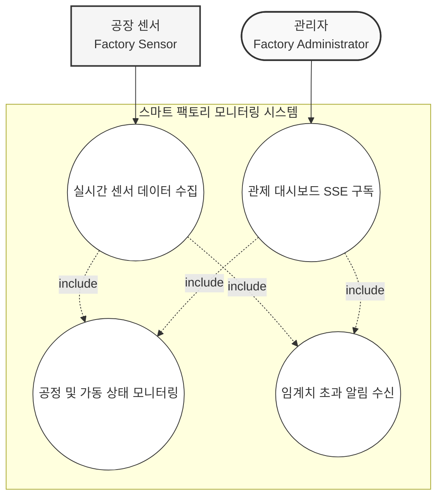
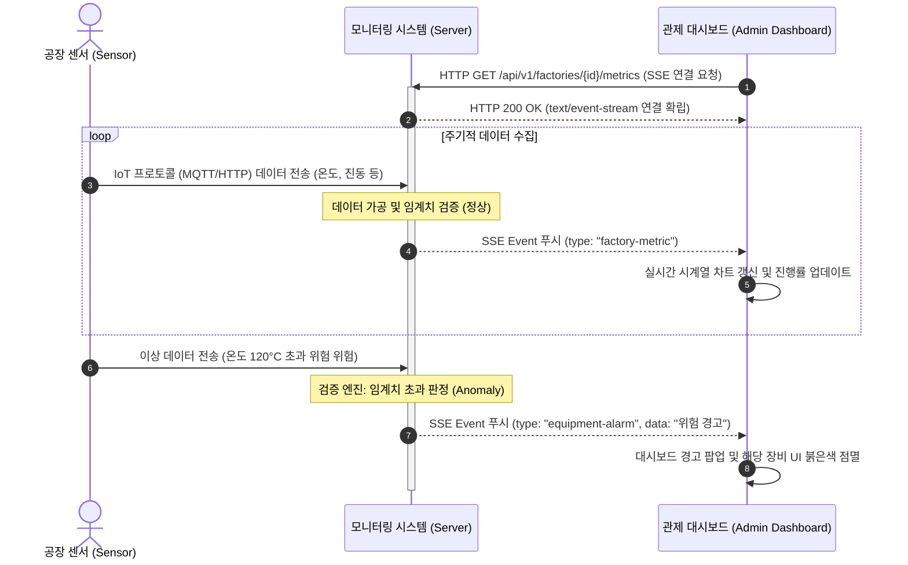
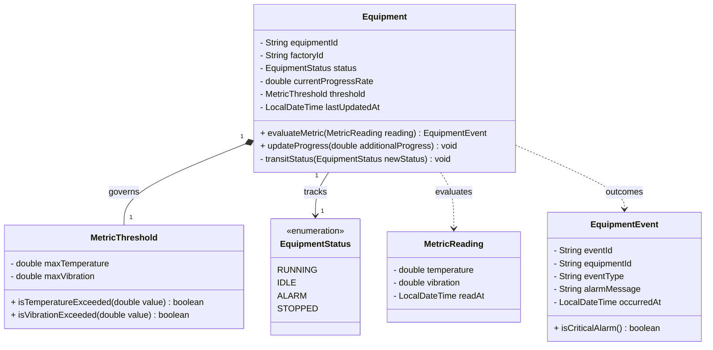
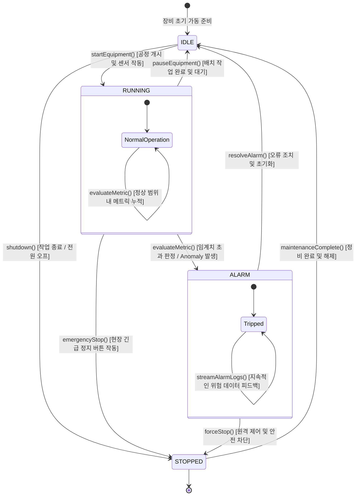

# Smart Factory Monitoring
Smart Factory Monitoring: 공장 센서의 메트릭 변화나 임계치 초과 이벤트를 대시보드로 실시간 단방향 브로드캐스팅함.
## Usecase

## Sequence

## Domain Model

## State Transition

## Policy

**요약 목록**

* **Equipment 데이터 및 상태 관리 규칙**: 진행률(`currentProgressRate`) 범위 검증 및 상태 다이어그램 규격에 맞는 안전한 내부 상태 전이 제어가 핵심임.
* **MetricThreshold & MetricReading 유효성 검사**: 센서 데이터의 물리적 한계점 검증(음수 값 차단) 및 임계치 비교 로직의 정확성 보장이 필요함.
* **EquipmentEvent 생성 규칙**: 이상 징후 발생 시 상태 전이와 연동된 원자적 이벤트 발행 및 알림 데이터 무결성 유지가 요구됨.

---

### 1. Equipment (애그리게잇 루트) 규칙 및 유효성 검사

* **공정 진행률 제약 조건 (`updateProgress`)**
* `currentProgressRate`는 항상 0% 이상 100% 이하의 범위를 유지해야 합니다. 공정 추가 진행률(`additionalProgress`)을 더했을 때 100%를 초과하려고 하면 100%로 상한선을 고정하거나, 공정 완료 이벤트(상태 전이)를 유도하는 도메인 로직이 작동해야 합니다.
* 장비가 가동 중이 아닌 상태(`IDLE`, `ALARM`, `STOPPED`)에서 진행률을 업데이트하려는 시도는 도메인 예외를 발생시켜야 합니다.

* **상태 기반 행위 가드 규칙 (`transitStatus`)**
* `evaluateMetric()` 호출 시, 현재 장비의 상태가 `STOPPED`라면 메트릭 평가를 수행하지 않고 즉시 반환하거나 예외를 처리해야 합니다.
* 내부 상태 전이 메서드인 `transitStatus()`는 제공된 **State Transition 다이어그램의 규칙을 강제**해야 합니다. 예를 들어, `RUNNING` 상태에서 관리자의 사전 조치(`resolveAlarm()`) 없이 즉시 `IDLE`로 돌아가는 규칙 위반 전이를 원천 차단해야 합니다.

### 2. MetricThreshold 및 MetricReading (밸류 오브젝트) 유효성 검사

* **물리적 수치 타당성 검증**
* 센서로부터 측정된 데이터(`MetricReading`)의 온도(캘빈/섭씨 기준 물리적 한계) 및 진동 값은 음수가 될 수 없으며, 시스템이 허용하는 최대 노이즈 범위를 초과하는 수치는 유효하지 않은 데이터로 간주하여 유입을 차단해야 합니다.
* `MetricThreshold`에 설정되는 `maxTemperature` 및 `maxVibration` 임계치 역시 0보다 커야 합니다.

* **임계치 평가 일관성**
* `isTemperatureExceeded()`와 `isVibrationExceeded()`는 단일 메트릭 값이 임계치와 '같거나 클 때' 초과로 판정할 것인지에 대한 경계 조건 규칙이 명확히 명시되어야 합니다.

### 3. EquipmentEvent (도메인 이벤트) 생성 및 발행 규칙

* **이벤트 생성 원자성**
* `evaluateMetric()`을 통해 임계치 초과가 감지되는 순간, `Equipment` 객체의 상태는 즉시 `ALARM`으로 변경되어야 하며, 변경과 동시에 내부 상태(상태 코드, 메시지 등)가 완전히 일치하는 `EquipmentEvent`가 원자적으로 생성되어야 합니다.

* **알림 메시지 정책**
* `alarmMessage`는 어떤 센서(온도 혹은 진동)가 임계치를 얼마나 초과했는지 명확히 식별할 수 있는 포맷으로 정밀하게 작성되어야 하며, 빈 값이나 식별 불가능한 일반 문자열은 허용되지 않습니다.