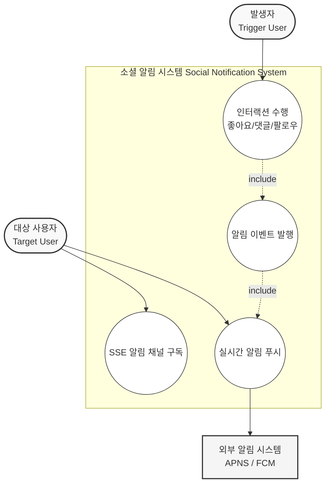
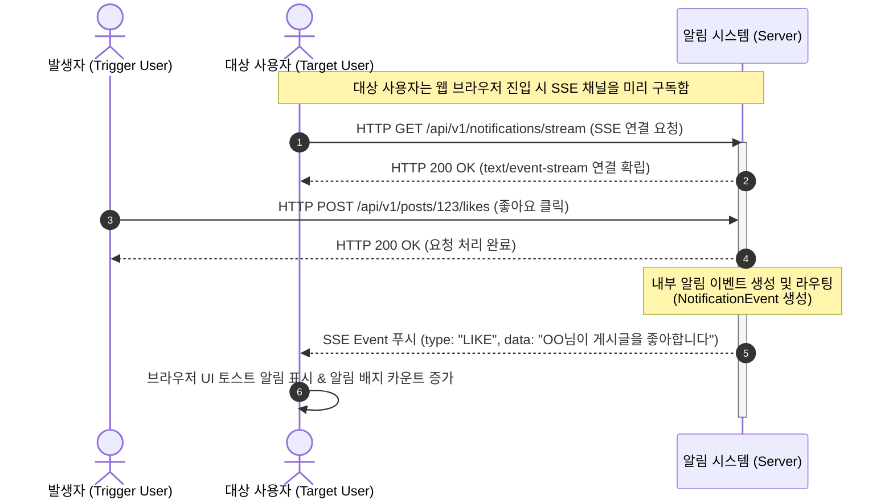
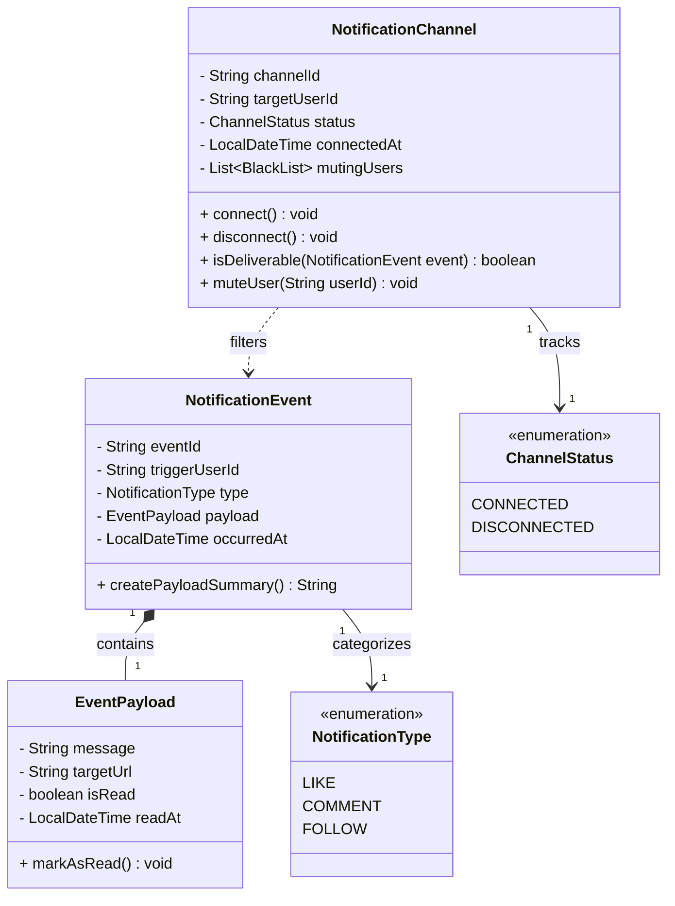
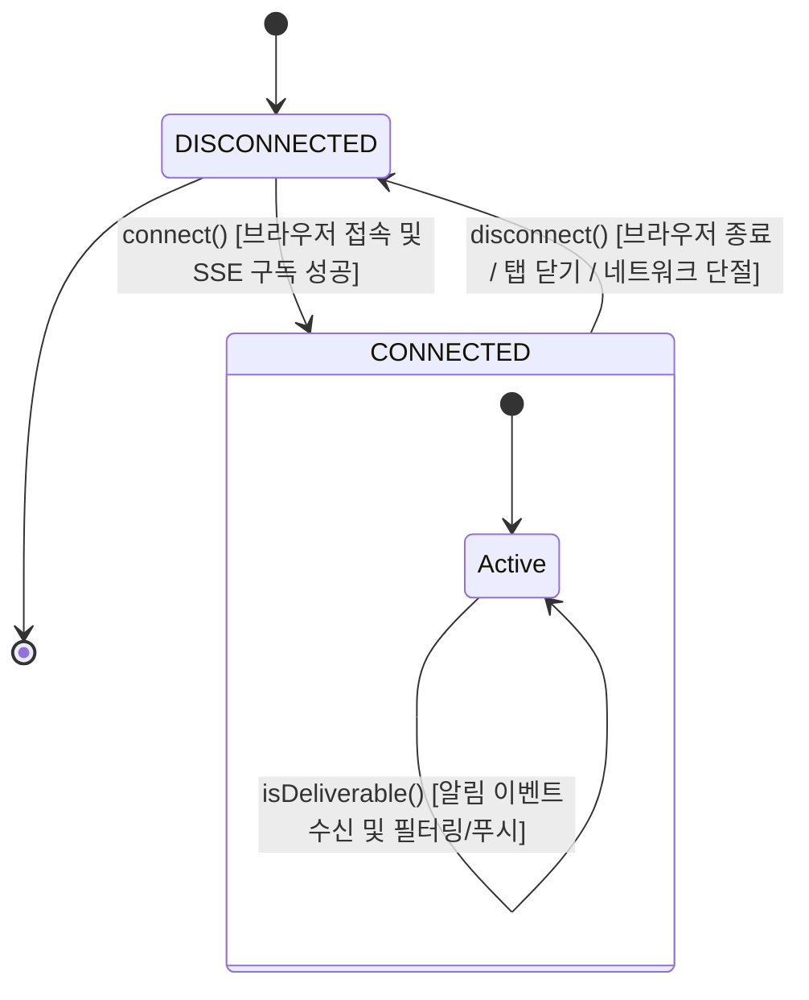

# Social Activity Notification

Social Activity Notification: 타 사용자의 인터랙션 발생 시 이벤트를 발행하고, 대상 사용자의 활성화된 SSE 채널로 알림을 즉시 푸시함.

## Usecase

## Sequence

## Domain Model

## State Transition

## Policy

**요약 목록**

* **NotificationChannel 규칙**: SSE 연결 유효성 검증, 상태 기반의 이벤트 수신 가용성 판단, 블랙리스트 기반의 수신 거부(Filtering) 필터링이 핵심임.
* **NotificationEvent 규칙**: 필수 메타데이터(발생자, 대상자, 타입) 검증 및 도메인 행위에 따른 메시지 정책 템플릿 검증이 요구됨.
* **EventPayload 규칙**: 타겟 URL 포맷 검증 및 읽음 처리(`markAsRead`) 시 상태 전이 원자성 확보가 필요함.

---

### 1. NotificationChannel (애그리게잇 루트) 규칙 및 유효성 검사

* **연결 및 해제 상태 검증**
* `connect()` 수행 시, 이미 상태가 `CONNECTED`라면 기존 연결을 강제 종료(Disconnect)하거나 예외를 발생시켜 **사용자당 하나의 활성화된 라우팅 채널**의 정합성을 보장해야 합니다.
* `disconnect()`는 상태가 `CONNECTED`일 때만 유효하며, 해제 시 `connectedAt` 타임스탬프를 정리하거나 비활성화 상태로 안전하게 전이해야 합니다.

* **이벤트 배달 가용성 검증 (`isDeliverable`)**
* 채널 상태가 `DISCONNECTED`인 경우 알림 푸시를 원천 차단하고 오프라인 보관소(Database)로 이벤트를 우회시키는 규칙이 필요합니다.
* `mutingUsers`(특정 사용자 알림 차단 목록)를 조회하여, 수신된 `NotificationEvent`의 `triggerUserId`가 차단된 사용자에 해당하면 `false`를 반환하는 필터링 유효성 검사를 수행해야 합니다.

### 2. NotificationEvent 규칙 및 유효성 검사

* **식별자 및 컨텍스트 무결성**
* `eventId`, `triggerUserId`, `type`은 객체 생성 시 누락될 수 없는 불변(Immutable) 값이어야 합니다.
* 자기 자신에게 알림을 보내는 행위(예: 내가 내 글에 좋아요를 누름)를 방지하기 위해 `triggerUserId`와 채널의 `targetUserId`가 동일한지 검증하여 불필요한 이벤트 발행을 차단하는 도메인 규칙을 적용할 수 있습니다.

* **페이로드 생성 규칙**
* `type`(LIKE, COMMENT, FOLLOW)에 따라 `EventPayload`의 기본 메시지 포맷이 올바르게 생성되었는지 구조적 유효성을 검사해야 합니다.

### 3. EventPayload 규칙 및 유효성 검사

* **이동 경로 유효성**
* 알림 클릭 시 이동할 `targetUrl`은 상대 경로 포맷(예: `/posts/123`)을 준수해야 하며, 시스템 외부의 악의적인 주소로 리다이렉트되지 않도록 화이트리스트 검증을 적용해야 합니다.

* **읽음 상태 전이 규칙 (`markAsRead`)**
* 이미 `isRead` 상태가 `true`인 경우, `readAt` 시간이 중복 갱신되지 않도록 가드 코드가 필요합니다.
* `isRead`가 `true`로 변경되는 순간 `readAt`은 현재 시점의 타임스탬프로 원자적으로 함께 설정되어야 합니다.